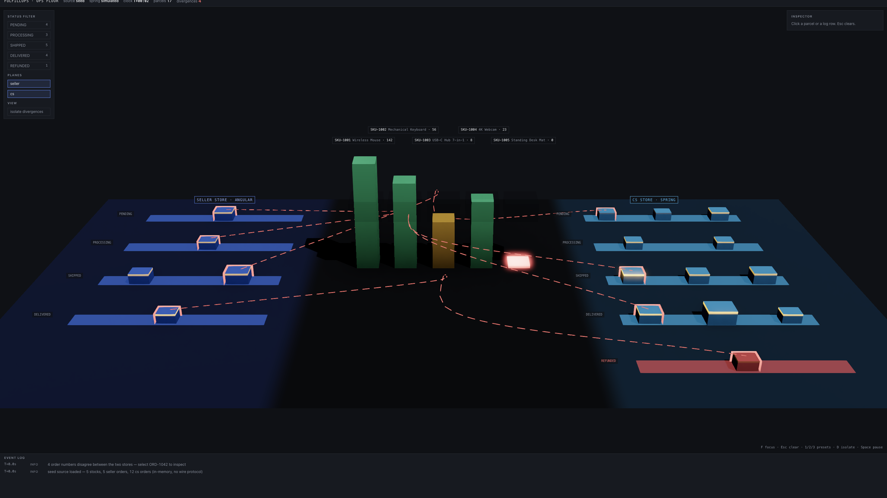

<div align="center">

# 📦 FulfillOps

**Multi-Stack Fulfillment & Seller Operations Platform**

[](./LICENSE)
[](https://github.com/pavan-dangeti/FulfillOps/actions/workflows/ci.yml)
[](https://fulfill-ops.vercel.app)


> A seller SPA and a server-rendered customer-service console on top of four Spring Boot services (orders, inventory, payments, fulfilment), each owning its own Postgres schema, with consumer-driven contracts between every client and service, and a Three.js view of the order domain.

**[→ Try the live 3D visualization](https://fulfill-ops.vercel.app)** — no install required.

</div>

<p align="center">
  
</p>

<p align="center"><em>Ops Floor in its default seed mode: seller orders (left) and CS orders (right) from the project's original two separate stores, with dashed arcs on the four orders that disagreed. The apps now share one order store; see <code>TRADEOFFS.md</code>.</em></p>

---

## 🏗️ Architecture

| Component | Stack | Runs on | Purpose |
|---|---|---|---|
| `services/order-service/` | Spring Boot 4, JPA, Flyway | `:8081` | Orders; issues access tokens |
| `services/inventory-service/` | Spring Boot 4, JPA, Flyway | `:8082` | SKUs, on-hand and reserved stock |
| `services/payment-service/` | Spring Boot 4, JDBC, Flyway | `:8083` | Simulated payments, one charge per order |
| `services/fulfilment-service/` | Spring Boot 4, JDBC, Flyway | `:8084` | Warehouse slot allocation |
| `common/` | Spring Security resource server | — | JWT validation and error mapping shared by the services |
| `seller-dashboard/` | Angular 21 (standalone, RxJS, Reactive Forms) | `:4200` | Inventory and order visibility for sellers |
| `cs-console/` | Spring Boot 4 + Thymeleaf + jQuery | `:8080` | Order lookup, refunds and shipping for CS reps; a client of order-service |
| `ops-floor/` | Vite + React + react-three-fiber | `:5174` | 3D visualization of the order domain |
| `contracts/pacts/` | Pact | — | Consumer-driven contracts, verified by each provider's build |
| `e2e-tests/` | Playwright + TypeScript | — | UI-level assertions over all three frontends |

```
 seller-dashboard (Angular) ──► order-service ─────► order_svc      ┐
                            └─► inventory-service ─► inventory_svc  │ one Postgres,
 cs-console (Thymeleaf) ─────► order-service                        │ one login role
 ops-floor ──► cs-console /api/ops (read-only)                      │ per schema
                               payment-service ────► payment_svc    │
                               fulfilment-service ─► fulfilment_svc ┘
```

Each service's database role owns exactly one schema and has no rights on any other, so services cannot read each other's tables (checked by `scripts/check-schema-isolation.sh` in CI). Every service is a stateless JWT resource server. `order-service` signs one-hour RS256 tokens for the operator accounts (seller, CS, and a read-only ops account) and publishes only its public key at `/.well-known/jwks.json`; the other services verify against it and cannot sign tokens themselves. `payment-service` and `fulfilment-service` implement idempotent charge/refund and allocate/cancel/ship operations with a read-only HTTP API; no order flow calls them yet.

Each app has its own `README.md` explaining why its stack was chosen. `TRADEOFFS.md` documents the notable compromises.

---

## ✨ Why two stacks — and a third view

FulfillOps mirrors a common real-world scenario: a modern reactive frontend for one user type (sellers) alongside a legacy-style server-rendered console for another (customer service reps), both driven by the same order and inventory domain.

`ops-floor/` adds a third view of that domain. Its default seed mode replays the project's original two-store dataset and draws an arc between orders that disagreed across the stores.

**A few things worth a closer look if you're reviewing the code:**

- **The database enforces the invariants.** `CHECK (reserved <= on_hand)` on inventory, a unique order number on payments (so a retried charge cannot charge twice), and `allocated <= capacity` on warehouses. Integration tests exercise each one, including concurrent charges and allocations from parallel threads.
- **Contracts, not hope.** The Angular services, the CS console's client and the services agree through Pact contracts: consumers record what they send and need, providers replay it against themselves with real Postgres, and CI fails if a regenerated contract differs from the committed one.
- **Rendering discipline, not just a scene.** `ops-floor/` runs `frameloop="demand"`, batches every parcel/tower/lane into a handful of `InstancedMesh` draw calls, and patches one shared material via `onBeforeCompile`. `?stats=1` exposes draw calls and triangle count live.
- **A canvas is opaque to a test runner — so it isn't treated as one.** Scene state is mirrored into a hidden DOM node, so Playwright asserts on rendered state the same way it does for the Angular and Thymeleaf apps.

---

## 🚀 Prerequisites

- **Docker** with Compose v2 (runs Postgres, the services and the CS console)
- **Node.js 22** for the frontends and the e2e suite
- **JDK 21** only to run the Maven build and tests outside Docker (`./mvnw` is bundled)
- **Playwright's Chromium** (`npx playwright install chromium`)

---

## ▶️ Run it

```bash
cp .env.example .env                    # local-only secrets and accounts
docker compose up --build --wait        # Postgres, 4 services, CS console (:8080)

cd seller-dashboard && npm install && npm start   # :4200, proxies /api to the services
cd ops-floor && npm install && npm run dev        # :5174, standalone seed mode
```

Local accounts (from `.env.example`): seller `seller` / `seller-dev-password`, CS `cs` / `cs-dev-password`. The `demo` Spring profile seeds a catalog, 12 orders and two warehouses on first start.

- **Seller dashboard without a backend:** open `http://localhost:4200/?demo=1` for the built-in seed data; nothing is saved.
- **Ops Floor against the stack:** `VITE_SOURCE=live npm run dev` polls the CS console's read-only `/api/ops/orders` feed for the CS plane; the seller plane stays seed-backed (see `ops-floor/README.md`).

---

## ✅ Tests

| Suite | Command | What it covers |
|---|---|---|
| Services and CS console | `./mvnw verify` | Integration tests against real Postgres (Testcontainers): auth and roles, validation, idempotent refunds and charges, concurrent charges and allocations, DB constraints; Pact provider verification; CS console rendering, CSRF and role checks |
| Seller dashboard | `cd seller-dashboard && npx ng test --watch=false` | Pact consumer tests driving the real Angular services |
| End to end | `cd e2e-tests && npx playwright test` | Recreates the compose stack on a fresh database, then drives all three frontends in Chromium |
| Schema isolation | `scripts/check-schema-isolation.sh` | Each service role can use only its own schema (run with the stack up) |

CI (`.github/workflows/ci.yml`) runs all four on every push and pull request.

**What the end-to-end suite proves**

- **Seller dashboard** — sign-in is required and a wrong password is rejected; orders load from order-service; adding a product and editing stock go through inventory-service; `?demo=1` works offline.
- **CS console** — search-as-you-type filtering and the detail page; the refund confirmation modal flips the badge inline and the refund survives a reload; shipping a processing order; sign-out ends the session.
- **Ops Floor** — the divergence count matches the known seed overlap; status filtering dims the right parcels without unmounting the canvas; selecting a divergent order shows a field-by-field diff; pausing freezes the sim clock; the seller plane has no REFUNDED lane.

---

## 📁 Project Structure

```
FulfillOps/
├── services/            # order, inventory, payment and fulfilment services (Spring Boot 4)
├── common/              # shared JWT resource-server config and API error mapping
├── cs-console/          # Spring Boot + Thymeleaf console for CS reps
├── seller-dashboard/    # Angular 21 SPA for sellers
├── ops-floor/           # Vite + React + Three.js view of the order domain
├── contracts/pacts/     # consumer-driven contracts (generated by consumer tests, committed)
├── e2e-tests/           # Playwright + TypeScript, cross-app UI assertions
├── deploy/postgres/     # per-service roles and schemas, created on first start
├── scripts/             # helper scripts (schema isolation check, run-all)
├── compose.yaml         # local stack
├── README.md
└── TRADEOFFS.md         # documented compromises and design decisions
```

---

## 📄 License

This project is licensed under the MIT License — see the [LICENSE](./LICENSE) file for details.
